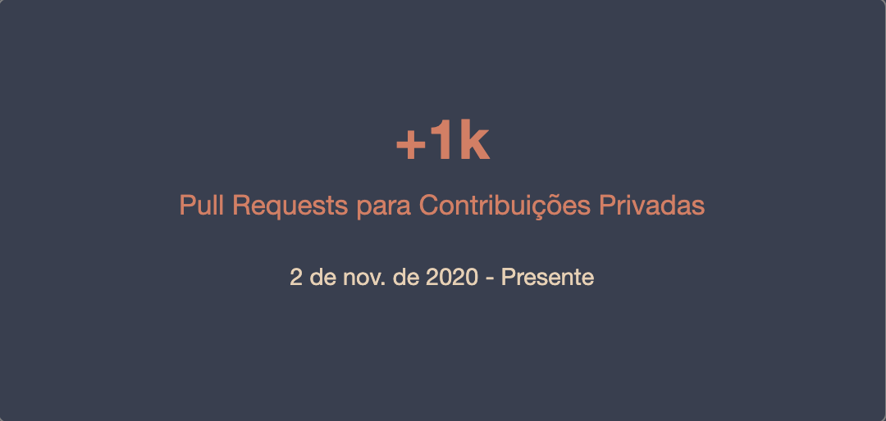

<h1 align="center">
  Olá! Seja bem vindo ao meu
  
</h1>

  Eu me chamo Maria Eduarda, mas pode me chamar de Duda. Sou desenvolvedora de software fullstack, bacharel em sistemas de informação e tenho experiência na área de tecnologia desde 2019. Aqui no meu GitHub estão alguns dos projetos realizados na faculdade e cursos, além de contribuições profissionais. Sinta-se à vontade para sugerir melhorias ou entrar em contato para conversarmos sobre tecnologia.

<h2>Contato:</h2>

  
  

<h2>Linguagens e Ferramentas:</h2>

<h3>Principais Linguagens:</h3>

  

<h3>Backend:</h3>

  

<h3>Frontend:</h3>

  

<h3>Testes</h3>

  

<h3>Banco de Dados</h3>

  

<h3>Servidores</h3>

  

<h3>Ferramentas</h3>

  

<h2>GitHub Status:</h2>

